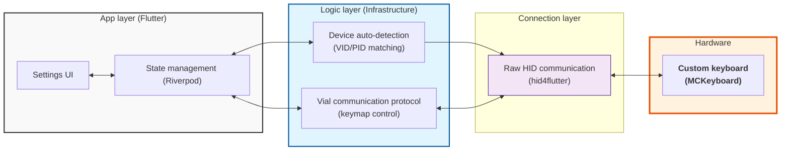

SwitchPalette is a Windows desktop application built with Flutter. Its design separates concerns into four distinct layers: UI, logic, OS integration, and hardware — with Firebase providing cloud persistence and AI capabilities.

## System diagram

The diagram below shows the core data flow between layers.

## Four-layer design

<CardGroup cols={2}>
  <Card title="App layer" icon="window">
    Flutter UI widgets and Riverpod state. Pages include device selection, the keymap editor, Beam (infrared) settings, and workflow management.
  </Card>
  <Card title="Logic layer" icon="gear">
    Infrastructure code: HID device discovery, the Vial protocol service, macro execution, workflow execution, and Firebase providers.
  </Card>
  <Card title="OS layer" icon="computer">
    Raw HID communication via `hid4flutter`. Also includes the Windows low-level keyboard hook (`WH_KEYBOARD_LL`) that monitors macro key presses and the `win32` SendInput API used to inject keystrokes.
  </Card>
  <Card title="Hardware layer" icon="keyboard">
    Physical Vial-compatible keyboards. The currently registered device is MCKeyboard (VID `0xFEED`, PID `0x6D63`), a 60% layout with 4 layers, 4 rows, and 14 columns.
  </Card>
</CardGroup>

## Firebase integration

SwitchPalette uses two Firebase services.

<CardGroup cols={2}>
  <Card title="Cloud Firestore" icon="database">
    Stores infrared codes (`codes` collection) and workflow definitions (`workflows` collection). Riverpod `StreamNotifier` providers subscribe to real-time snapshots so the UI updates without polling.
  </Card>
  <Card title="Firebase AI (Gemini)" icon="sparkles">
    Powers the `aiTextConvert` macro type. When triggered, the app reads selected text via the clipboard, sends it with a user-defined prompt to `FirebaseAI.googleAI().generativeModel(...)`, and pastes the response back.
  </Card>
</CardGroup>

## Windows integration

| Package | Role |
|---|---|
| `tray_manager` | System tray icon and context menu. Lets users show or quit the app from the tray. |
| `bitsdojo_window` | Custom title bar and window control (show, hide, close). |
| `windows_notification` | Native Windows toast notifications for macro execution results. |
| `win32` | Low-level keyboard hook (`SetWindowsHookEx`) and synthetic key injection (`SendInput`). |
| `hid4flutter` | Cross-platform HID device enumeration, open, send, and receive. |

## State management

SwitchPalette uses `hooks_riverpod`. Each major feature area has its own Notifier or AsyncNotifier:

| Provider | Type | Responsibility |
|---|---|---|
| `vialProvider` | `NotifierProvider<VialNotifier, VialState>` | HID connection lifecycle, keymap read/write, key label resolution |
| `MacrosProvider` | `AsyncNotifierProvider<MacrosNotifier, List<Macro?>>` | Load and persist all 12 macro slots from `shared_preferences` |
| `firebaseCodesStreamProvider` | `StreamNotifierProvider<FirebaseCodesStreamNotifier, List<InfraredCode>>` | Real-time infrared code list from Firestore |
| `firebaseWorkflowProvider` | `StreamNotifierProvider<FirebaseWorkflowNotifier, List<Workflow>>` | Real-time workflow list from Firestore |
| `openAppProvider` | `AsyncNotifierProvider<OpenAppNotifier, List<Macro>>` | Enumerates installed Windows applications via PowerShell registry query |
| `workflowEditProvider` | `NotifierProvider.autoDispose<WorkflowEditNotifier, Workflow>` | In-progress workflow being edited in the workflow editor |

## Key data flows

### Keymap read flow

<Steps>
  <Step title="User selects a device">
    `VialNotifier.connect()` is called with the chosen `HidDevice`. The notifier opens the HID handle via `VialService.connect()`.
  </Step>
  <Step title="Keymap is fetched">
    `VialService.getKeymap()` calls `dynamicKeymapGetBuffer` (command `0x12`) in 28-byte chunks until the full `layers × rows × cols × 2` byte buffer is read.
  </Step>
  <Step title="State is updated">
    The raw integer matrix is converted to human-readable labels with `VialKey.labelFromCode()` and stored in `VialState.keyMappings`. The UI re-renders.
  </Step>
</Steps>

### Macro execution flow

<Steps>
  <Step title="Key press detected">
    `KeyboardMonitor` runs a low-level keyboard hook in a dedicated Dart isolate. On `WM_KEYDOWN`, it sends the virtual key code and scan code back to the main isolate.
  </Step>
  <Step title="Macro looked up">
    The main isolate checks whether the pressed key code is one of the 12 monitored macro keys (`0x7C`–`0x87`, corresponding to F13–F24). If so, `AppPreferences.getMacro()` deserialises the stored `Macro` from `shared_preferences`.
  </Step>
  <Step title="Macro dispatched">
    `MacroService.runMacro()` switches on `MacroType` and executes the appropriate action: updating Firestore for `infrared`, calling `KeySender.sendMultiKeyPush()` for `combo`, writing to the clipboard for `text`, launching a process for `openApp`, or calling the Gemini AI for `aiTextConvert`.
  </Step>
</Steps>

### Infrared signal send flow

<Steps>
  <Step title="Macro triggers infrared action">
    `MacroService` receives a `MacroType.infrared` macro with a Firestore document ID in `macro.docId`.
  </Step>
  <Step title="Firestore document updated">
    `FirebaseCodesStreamNotifier.updateCodes()` sets `state: true` on the infrared code document.
  </Step>
  <Step title="Hardware device reads the flag">
    An external microcontroller (Beam hardware) monitors the Firestore document. When `state` becomes `true`, it transmits the IR signal stored in the `code` field.
  </Step>
</Steps>
